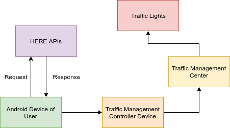

# Geofencing for Emergency Vehicles
## Problem Statement
The ever-increasing traffic in India is an intensifying problem. The vehicle density is increasing at a much faster pace than road length, thus causing congestion. This congestion may impede the ability of emergency vehicles to reach the site of a traffic incident or other disaster in a fast and reliable manner. It is imperative that emergency dispatchers use real time traffic information in order to improve dispatching of Emergency Medical Services (EMS) to the disaster site. It is thus necessary for such services to react to emergency calls with minimum delay.

# Objective
The objective is to solve this problem by using geofencing techniques to enable easy navigation of emergency vehicles ensuring them reaching destination on time.

**Geofencing** is the use of GPS or RFID technology to create a virtual geographic boundary, enabling software to trigger a response when a mobile device enters or leaves a particular area. A geo-fence could be dynamically generated—as in a radius around a point location, or a geo-fence can be a predefined set of boundaries.

# Implementation
A webapp which lets the ambulance driver to get information about the traffic so that it can request TCMS(Traffic control management system) to turn the traffic signals to green when the vehicle reaches near any signal so as to avoid traffic and delay in taking patient to hospital. This will help in providing a better approach towards the patient's safety.

Landing Page for the Application.

# Desktop View

# Mobile View

# Discussion of Approach

Use of HERE Map API to fence the busiest intersections of the city of interest (say, Delhi) will be done. Geofencing is beneficial for long-range outdoor targetting which is usually an area of 50m to 50,000m in radius. The efficiency of fencing could be increased by emperically calcualting the value of radius. A specific point in the map will be represented by the latitude and longitude of the point. Hence, to define the proximity: 3 parameters namely, latitude, longitude and radius will be considered. This would define the so-called geo-fence.

Now, the implementation is to be done via a webapplication interface, which would be used as a system to trigger the localized geofences. The end-user (say, emergency vehicle driver) would choose an emergency class (say, Road Accident). The app would automatically route the user to the nearest hospital. Once the user starts navigating (via the emergency vehicle) to the destination, and approaching an intersection, the geo-fence of the intersection is triggered some distance before the vehicle approaches the intersection and an alert for a green single to the Traffic Management Controller (via the TMC tables of HERE) will be sent. The response time of the emergency vehicle is thus reduced, also alleviating the chances of an accident at the intersection when the vehicle is trying to make its way.

# Contributions

1. Contibutions are welcomed.
2. Contributors are requested to not make changes on master branch. Instead, create new branch and pull request for the changes you made.
